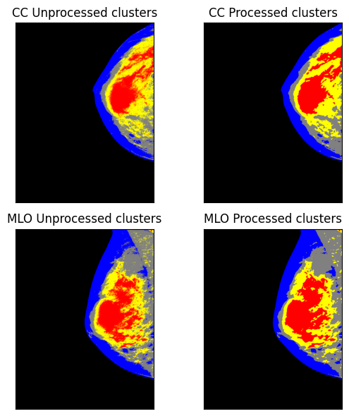

# Breast image pre-processing for mammographic tissue segmentation
## Authors
This project was created by [David Morales](https://www.linkedin.com/in/david-morales-361b41282/) and [Anastasia Kuflievskaya](https://www.linkedin.com/in/anastasia-natalie-kuflievskaya-salas-72a309203/).

---

## Brief summary
The focus of this project is to develop and implement a pre-processing technique for mammographic images, so as to enhance tissue segmentation of a mammogram. In view of the methods that have been followed in some relevant literature, we have applied a sequence of considered processing steps that includes periphery separation, intensity ratio propagation, breast thickness estimation, and intensity balancing. These techniques address common issues like uneven illumination and intensity variations that may hamper accurate image analysis. Our results indicate a better breast tissue segmentation and visualization, therefore enabling more accurate breast cancer diagnosis.

## Pipeline steps
1. Breast periphery separation (breast region mask extraction).
2. Intensity ratio propagation (local correction near the periphery).
3. Breast thickness estimation (geometric approximation using parallel lines).
4. Intensity balancing (global correction based on propagated ratios).
5. Tissue clustering (K-Means) to visualize segmentation improvement.

---

## Example result

Below there is an example image showing the results of our pre-processing method. The enhanced segmentation clearly identifies the breast tissue, allowing for more accurate subsequent analysis.



The output folder contains intermediate images for each step (periphery mask, intensity correction, thickness estimation visualization, balanced images, and clustering results).

---

## Installation
### Requirements
- Python 3.12+
- [Poetry](https://python-poetry.org/)

### Install dependencies
From the project root:
```bash
pip install poetry
poetry install
```

---

## Dataset
This project uses the [INBreast](https://www.kaggle.com/datasets/tommyngx/inbreast2012) dataset. Download it and store it in your project folder.

---

## Convert DICOM to PNG
The dataset is in DICOM format (`.dcm`), it should be converted first:
```bash
poetry run dicom_to_png --input path/to/AllDICOMs --output data
```
This will generate `.png` images that can be processed by the pipeline.

---

## Usage
The preprocessing pipeline can be executed in two different modes:

- Single mode: runs the pipeline on one CC/MLO pair, useful for debugging, testing parameters, and quickly checking results.
- Batch mode: runs the pipeline on all valid CC/MLO pairs found inside the input folder, useful for processing the full dataset.

### Run preprocessing (single mode)
```bash
poetry run breast_preprocessing --input data --output output_images --mode single
```
### Run preprocessing (batch mode)
```bash
poetry run breast_preprocessing --input data --output output_images --mode batch
```

---

## Output files
For each CC/MLO pair, the pipeline saves:
- separate_periphery_\<ID>.png
- intensity_ratio_propagation_\<ID>.png
- MLO_peripheral_area_\<ID>.png
- balanced_images_\<ID>.png
- clustering_images_\<ID>.png

---

## Project report

For a full explanation of the methods and steps we followed, refer to the `docs/report.pdf` file, which contains the detailed scientific paper on our approach.

---

## License

This project is licensed under the Apache License 2.0.
See the LICENSE file for details.

---

## Notes / Troubleshooting

- If running from a subfolder, use correct relative paths (recommended: run from the project root).
- Batch mode may take longer due to pixel-wise operations.

---

## Limitations
For now, the pipeline is designed and tested only for right-breast mammograms (files containing R in their names, e.g. MG_R_CC and MG_R_ML). Left-breast images (L) are not currently supported and may produce incorrect results.
